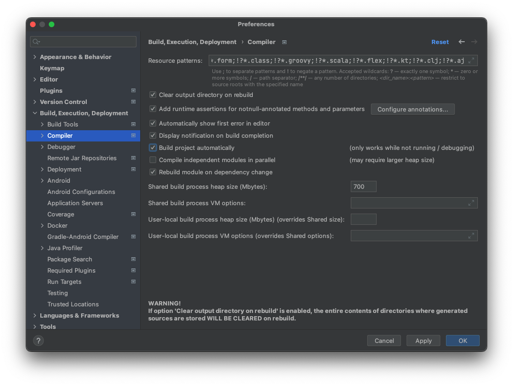

spring boot reactive 프로젝트를 위한 템플릿 입니다.

업데이트 기준일 : 2022년 9월 18일

# 목차
- [1. 프로젝트 구성](#1.-프로젝트-구성)
- [2. Spring Profile 구분](#2.-Spring-Profile-구분)
- [3. 개발환경 설정](#3.-개발환경-설정)
- [4. 배포](#4.-배포)
---

# 1. 프로젝트 구성
## java
java 17을 적용하였습니다.

## Build Tool
`Gradle 7.5.1`을 적용하였습니다. 

## spring boot
`2.7.3` 버전이 적용되었습니다.

## Testing
### junit 5
junit 5를 사용하여 단위 테스트를 작성합니다.

`org.junit.jupiter:junit-jupiter-api:5.9.0` 가 적용되었습니다. 

### assertj
단위 테스트 작성시에 assert 작성은 assertj를 사용하여 작성합니다.
`org.assertj:assertj-core:3.23.1` 가 적용되었습니다.

### Database 
로컬 테스팅 환경에서는 h2를 사용하여 테스트를 수행합니다.

# 2. Spring Profile 구분
## test
로컬 환경에서 단위 테스트를 수행하기 위한 프로파일입니다. 

단위 테스트 환경에서 특정 시스템이나 서비스에 의존적이지 않게 테스트 케이스를 작성하기 위하여 필요한 설정을 해당 프로파일에 정의 합니다.

DB와 관련된 단위테스트에서는 h2 메모리 데이터베이스를 사용하여 수행하도록 구성되어 있습니다.

## local
로컬 환경에 필요한 서비스를 구축하고 개발단계에서 테스트를 수행하기 위한 프로파일 입니다.

이 프로파일은 로컬 환경(localhost)에 필요한 DB, 캐시, 타 서비스 api 등 어플리케이션이 수행되는데 필요한 모든 시스템을 설치하고 이를 이용하여 테스트 하기 위한 설정을 정의합니다.

## dev
별도의 개발 서버에 필요한 서비스를 구축하고 개발단계에서 테스트를 수행하기 위한 프로파일 입니다.

local 프로파일과 다른점은 필요한 시스템이 로컬환경이 아닌 분리된 시스템에 있음을 의미합니다. 필요한 각 시스템들이 모두 하나의 서버에 구성될 필요는 없습니다.

## prod
운영 환경에 필요한 설정을 정의합니다.

# 3. 개발환경 설정
## Intellij spring auto reload
Intellij 상에서 spring boot 의 auto reload 설정을 하기 위해서는 아래의 설정이 필요합니다.

Intellij 버전은 `Build #IU-222.3345.118` 을 기준으로 작성된 내용입니다. (2022년 9월 19일 기준 최신 업데이트)

### settings 설정
build > compiler의 "Build project automatically" 를 활성화 합니다.

### Spring Boot Run Configuration 설정

Spring boot Run configuration 에서 "Modify Options" 에 아래 설정을 추가합니다.
- On 'Update' action: Update classes and resources
- On frame deactivation: Update classes and resources

# 4. 배포 
## spring boot docker
`docker/spring_boot_deployment` 디렉토리하위에 아래의 파일이 정의되어 있습니다.
- `docker-build.sh` : docker 이미지 생성용 shell script (현재 미작성)
- `Dockerfile-prod` : 운영 배포용 dockerfile
- `spring-boot-docker-compose.yml` : spring boot 서비스 docker-compose